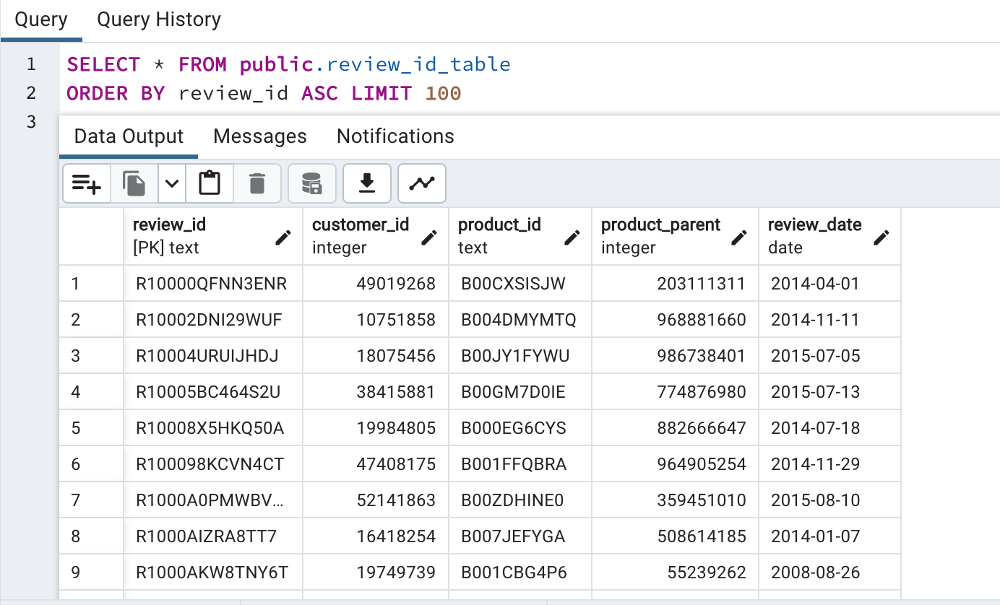

# Amazon_Vine_Analysis

# **Purpose**

In this study, an analysis was performed on Amazon reviews written by members of the paid Amazon Vine program, specifically apparel reviews. The Vine program is a paid service by companies who wish to have their products reviewed by vetted and trusted amazon customers. These customers receive the products free of charge but are required to write a review. The goal was to determine if there is any bias towards favorable reviews from the Vine apparel dataset

## **Goal**

- Perform ETL on Amazon Product Reviews
- Determine Bias of Vine Reviews
- A Written Report on the Analysis 

## **Resources**

- Dataset: https://s3.amazonaws.com/amazon-reviews-pds/tsv/amazon_reviews_us_Apparel_v1_00.tsv.gz
- Software: pgAdmin4, PySpark, Pandas, SGL, AWS RDS

# **Results**

An AWS RDS database was created with tables in pgAdmin. Then the Extract, Transform, and Load (ETL) process was performed  on Amazon product reviews for apparel. The dataset was loaded into Google Colab with PySpark in the form of a dataframe. The original dataframe was transformed into four separate DataFrames that match the table schema in pgAdmin. The transformed dataframes were uploaded into their corresponding tables. See below for a sample of the four tables in the database:

   

Next queries were performed to determine the bias of Vine review. These queries answered the question:

*How many Vine reviews and non-Vine reviews were there?* In the filtered dataset, there were 33 Vine reviews and 45,388 non-Vine reviews.
 
 

*How many Vine reviews were 5 stars? How many non-Vine reviews were 5 stars?* In the filtered dataset, there were 15 Vine reviews and 23,733 non-Vine reviews.

 

*What percentage of Vine reviews were 5 stars? What percentage of non-Vine reviews were 5 stars?* In the filtered dataset, 45% of Vine reviews were 5 stars and 52% of non-Vine reviews were 5 stars.

 

## Summary 
